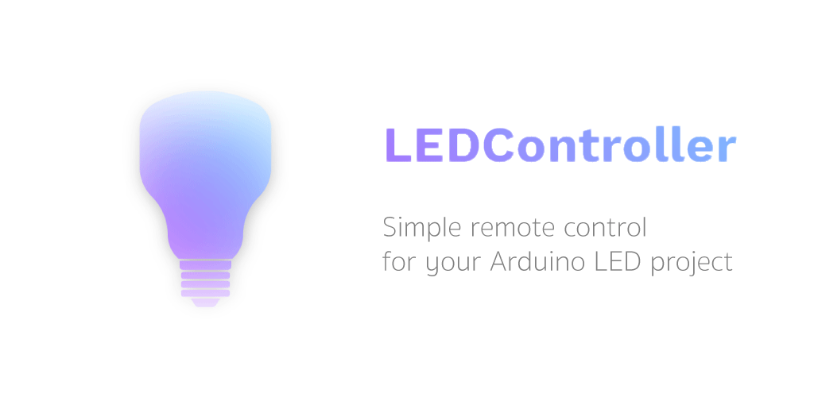

# About
This repo contains source code for an app which controls LED strips via Bluetooth.

Main project repository:
https://github.com/tmaxxdd/Arduino-LED-Controller

# Download

Download it from Play Store

